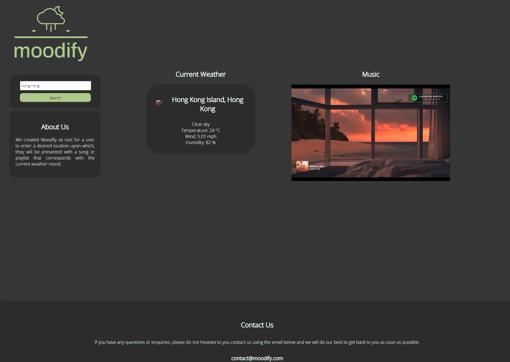

# Moodify Project

## Description
A website that finds a song in Youtube to match the mood based on the weather in the specified location.

## User Story

```
AS A user
I WANT to check the weather and find a playlist or song matching it
SO THAT I can listen to song that matches the weather whilst I study, relax or work
```

## Acceptance Criteria

```
GIVEN a weather dashboard with form inputs and pulls a playlist or playlist
WHEN I search for a city and select search
THEN I am presented with current weather information of the day
THEN I am presented with a YouTube video with a mood corresponding to the current weather in that location
When I enter a new location
Then I am presented with new weather results and new video to match the new weather
Then the data is saved in local storage
When i resize the page or view the site on various screen sizes or devices
THEN I am presented with a responsive layout that adapts to my viewport
```

## Technologies used
* HTML
* CSS
* JavaScript

## API's
* Weather API : https://openweathermap.org/api
* YouTube API V3

## Project Requirements
You and your group will use everything you’ve learned over the past six modules to create a real-world front-end application that you’ll be able to showcase to potential employers. The user story and acceptance criteria will depend on the project that you create, but your project must fulfil the following requirements:
* Use a CSS framework other than Bootstrap.
* Be deployed to GitHub Pages.
* Be interactive (i.e., accept and respond to user input).
* Use at least two [server-side APIs](https://coding-boot-camp.github.io/full-stack/apis/api-resources).
* Does not use alerts, confirms, or prompts (use modals).
* Use client-side storage to store persistent data.
* Be responsive.
* Have a polished UI.
* Have a clean repository that meets quality coding standards (file structure, naming conventions, follows best practices for class/id naming conventions, indentation, quality comments, etc.).
* Have a quality README (with unique name, description, technologies used, screenshot, and link to deployed application).


## Deployed link
 https://tiiingaling.github.io/Project-1-Moodify/
